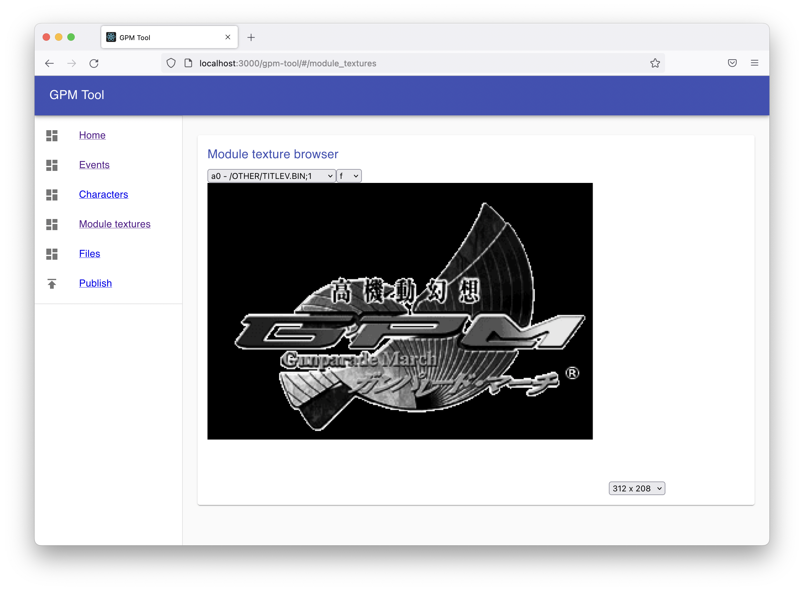
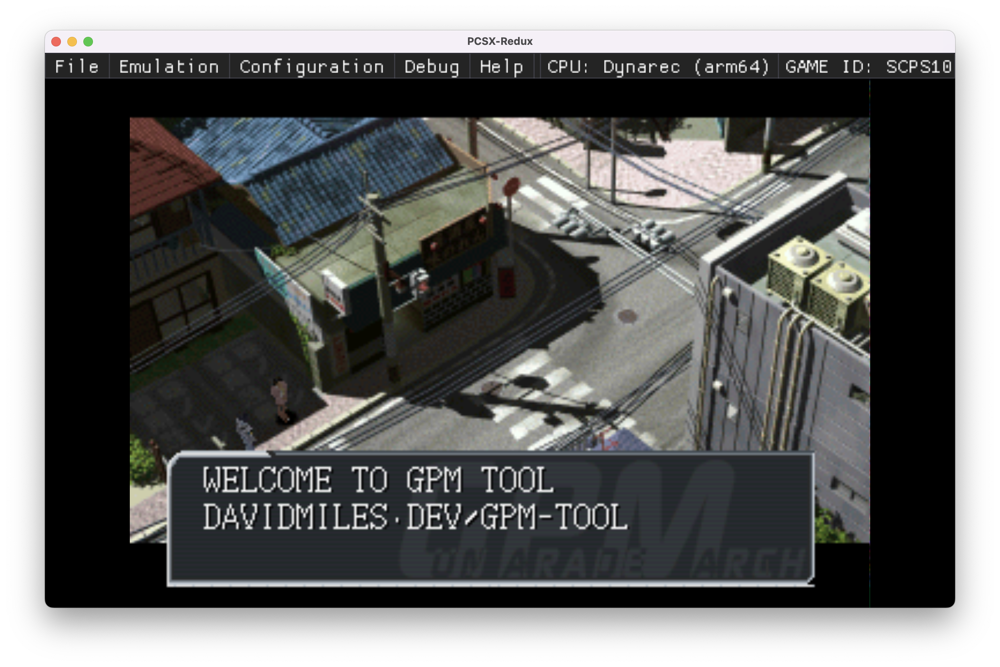
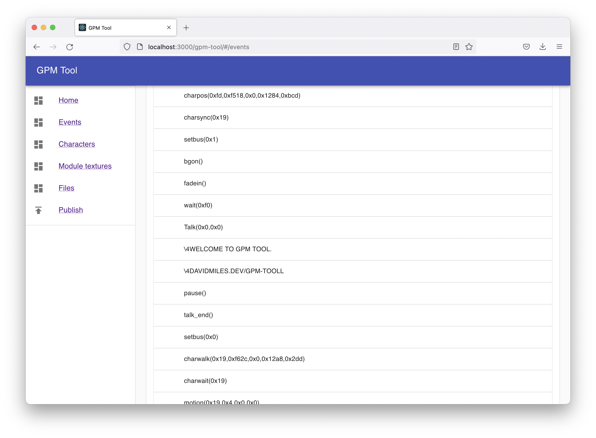

# GPM Tool

Welcome to a very early version of gpm-tool. This tool can currently open a [GunParade March](https://en.wikipedia.org/wiki/Gunparade_March) BIN file, and allows you to:

- View the script for story events in the game
- Browse raw textures
- Make changes to the text in story events
-Save out a BIN file containing a version of the game with your text changes
       
This tool is capable of saving text for events with escape codes such that text with (currently only capitalised) Latin characters will render correctly in the game.

This tool can decompress the images used in the game, but in many cases the dimensions of these aren't saved with the image, and for images other than event images, we can't easily determine the correct palette to use. If an image looks wrong, try adjusting the size control next to up or down an option to find the correct size.

Although you are required to use your browser's upload UI to open the .BIN file, no data from this tool will ever leave your machine, and no data from the game is included with this tool.

